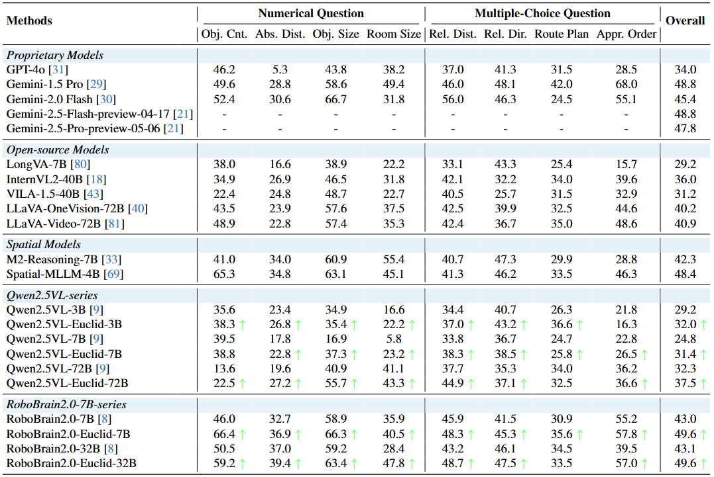

# Euclid’s Gift: Enhancing Spatial Perception and Reasoning in Vision‑Language Models via Geometric Surrogate Tasks
[](https://github.com/LiamLian0727/Euclids_Gift/issues)
[](https://github.com/LiamLian0727/Euclids_Gift/fork)
[](https://github.com/LiamLian0727/Euclids_Gift/stargazers)
[](https://huggingface.co/papers/2509.24473)
[](https://huggingface.co/datasets/LiamLian0727/Euclid30K)
[](https://arxiv.org/abs/2509.24473)
[](LICENSE)

## Abstract
Spatial intelligence spans abilities such as visualizing and transforming shapes, mental rotation, reasoning about relative positions and containment, and counting/estimation. These remain challenging for modern Multimodal Large Language Models (MLLMs). We propose solving Euclidean geometry problems as a surrogate task and construct Euclid30K, a dataset of roughly 30K 2D and 3D geometry questions. We then fine‑tune Qwen2.5‑VL and RoboBrain2.0 models with Group Relative Policy Optimization (GRPO), enabling the models to internalize and apply Euclidean principles for shape recognition, counting, relation extraction, and multi‑step deductive reasoning. Without task‑specific adaptations, our models achieve significant zero‑shot gains on four spatial‑reasoning benchmarks: Super‑CLEVR, Omni3DBench, VSI‑Bench, and MindCube. For example, on VSI‑Bench, average accuracy improves from 34.5% to 40.5% (+5.5 percentage points); RoboBrain2.0‑Euclid‑7B reaches 49.6%, surpassing the previous SOTA (Spatial‑MLLM).


## 📢 News
- 🚀 [09/30/2025] We release our paper in [arXiv](https://arxiv.org/abs/2509.24473) and Euclid30K dataset in [huggingface](https://huggingface.co/datasets/LiamLian0727/Euclid30K).

## Quick Start

### 1) Environment Setup
Training
- Install [EasyR1](https://github.com/hiyouga/EasyR1) following the official documentation.
- Install the required Python dependencies: `pip install -r requirements.txt`.
- Download the Euclid30K dataset from Hugging Face: https://huggingface.co/datasets/LiamLian0727/Euclid30K

Evaluation
- Install [lmms‑eval](https://github.com/EvolvingLMMs-Lab/lmms-eval) following its official documentation. You can either:
  - Use the [`lmms-eval/`](https://github.com/EvolvingLMMs-Lab/lmms-eval) copy included in this repository; or
  - Copy the four task folders provided under `test/lmms_eval/tasks/` into your existing lmms‑eval setup.
- Download the benchmark datasets [Super‑CLEVR](https://huggingface.co/datasets/MMInstruction/SuperClevr_Val), [Omni3DBench](https://huggingface.co/datasets/dmarsili/Omni3D-Bench), [VSI‑Bench](https://huggingface.co/datasets/nyu-visionx/VSI-Bench), and [MindCube_lmms_eval](https://huggingface.co/datasets/LiamLian0727/MindCube_lmms_eval); then update the dataset paths in each corresponding YAML under `test/lmms_eval/tasks/`.

### 2) Training

Below is an example command for training (e.g., 8 GPUs). For multi‑node multi‑GPU training, see the example script [train/dist_train.sh](train/dist_train.sh).

```bash
python3 -m verl.trainer.main \
    config=examples/config.yaml \
    data.train_files=/mnt/datasets/Euclid30K/Euclid30K_train.parquet \
    data.val_files=/mnt/datasets/Euclid30K/Euclid30K_val.parquet \
    worker.actor.model.model_path=/mnt/models/Qwen2.5-VL-7B-Instruct \
    trainer.experiment_name=EXPERIMENT_NAME \
    worker.actor.micro_batch_size_per_device_for_update=1 \
    worker.actor.micro_batch_size_per_device_for_experience=8 \
    worker.actor.clip_ratio_low=0.2 \
    worker.actor.clip_ratio_high=0.28 \
    worker.reward.reward_function=/mnt/code/Euclids_Gift/train/euclid.py:compute_score \
    algorithm.online_filtering=True \
    trainer.total_epochs=10 \
    trainer.n_gpus_per_node=8 \
    trainer.nnodes=2 \
    trainer.save_checkpoint_path=/mnt/models/Qwen2.5-VL-7B-Euclid
```

### 3) Evaluation



Use [`test/eval_qwen.sh`](test/eval_qwen.sh), [`test/eval_robo.sh`](test/eval_robo.sh), and [`test/eval_euclid.sh`](test/eval_euclid.sh) to evaluate the Qwen2.5‑VL series, the RoboBrain 2.0 series, and Euclid models trained on Euclid30K, respectively.

Before running these scripts, set `model_path` in each script to the path of the model you want to evaluate.

## Citation
If you find this project or the dataset helpful, please cite:
```bibtex
@misc{Euclids_Gift,
    title={Euclid’s Gift: Enhancing Spatial Perception and Reasoning in Vision-Language Models via Geometric Surrogate Tasks},
    author={Shijie Lian and Changti Wu and Laurence Tianruo Yang and Hang Yuan and Bin Yu and Lei Zhang and Kai Chen},
    year={2025},
    eprint={2509.24473},
    archivePrefix={arXiv},
    primaryClass={cs.CV},
    url={https://arxiv.org/abs/2509.24473}
}
```

## Acknowledgements

We thank the [VeRL](https://github.com/volcengine/verl) / [EasyR1](https://github.com/hiyouga/EasyR1) training framework, as well as the benchmark suites [Super‑CLEVR](https://huggingface.co/datasets/MMInstruction/SuperClevr_Val), [Omni3DBench](https://huggingface.co/datasets/dmarsili/Omni3D-Bench), [VSI‑Bench](https://huggingface.co/datasets/nyu-visionx/VSI-Bench), and [MindCube](https://huggingface.co/datasets/MLL-Lab/MindCube).

## ⭐ Stargazers
[](https://github.com/LiamLian0727/Euclids_Gift/stargazers)
